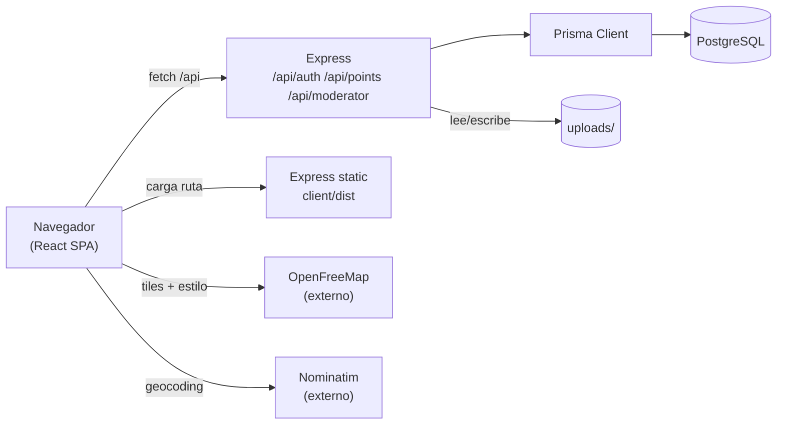

# Arquitectura general

**Monolito** de una sola pieza: un proceso Node/Express sirve a la vez la **API** (`/api/*`), los **uploads estáticos** (`/uploads/*`) y el **SPA React** compilado (todo lo demás).

## Componentes

## Flujo de una petición

1. El navegador pide `/api/points?type=ayuda`.
2. En **dev**, Vite hace proxy de `/api` y `/uploads` al Express en `:4000` (ver [[Cliente HTTP (api)]]).
3. Express → middleware (cors, json, cookieParser) → router → Prisma → Postgres.
4. En **producción**, Express sirve además `client/dist/index.html` para cualquier ruta no-API (SPA fallback).

## Layers del backend

- **`index.ts`** → arranca el server en `PORT` (default `4000`).
- **`app.ts`** → construye la app Express, monta middlewares y routers, sirve estáticos y SPA fallback.
- **`routes/`** → `auth`, `points`, `moderator` (ver [[API REST - endpoints]]).
- **`middleware/`** → `auth` (requireAuth/requireModerator/attachUserIfPresent), `upload` (multer).
- **`lib/`** → `prisma`, `jwt`, `password` (bcrypt), `code` (verificación).
- **`prisma/`** → schema y migraciones.

## Frontend

- SPA React 18 + Vite, montada en `main.tsx` con `BrowserRouter` + `AuthProvider`.
- Una sola página principal (`Home`) con mapa + panel lateral.
- Estado de sesión en contexto (ver [[AuthContext y estado de sesión]]).

## Relacionado

- [[Stack tecnológico]]
- [[Estructura del repositorio]]
- [[Diagramas Mermaid]]
- [[Build y producción]]
