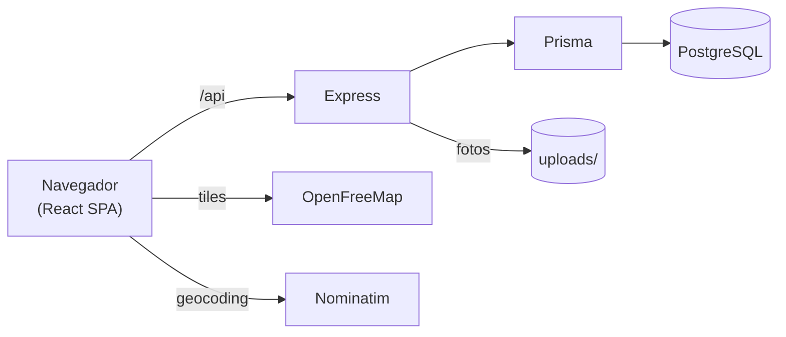
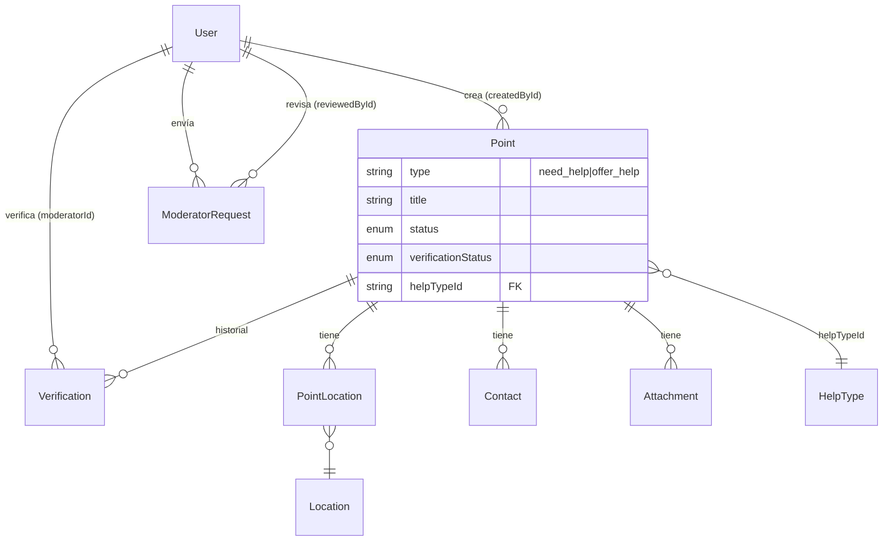
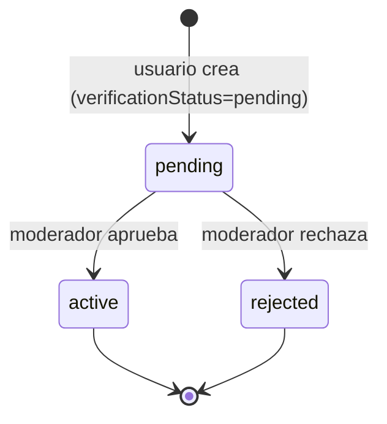
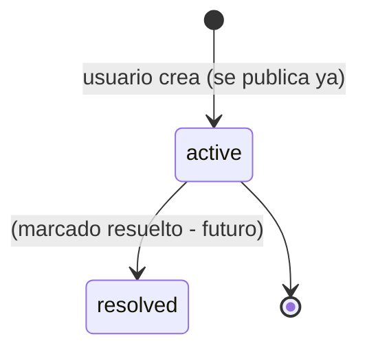
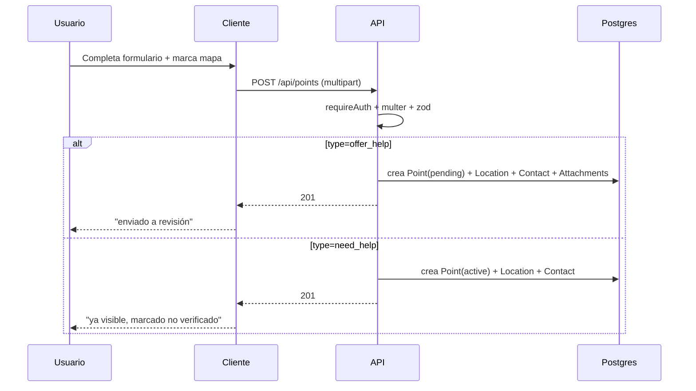
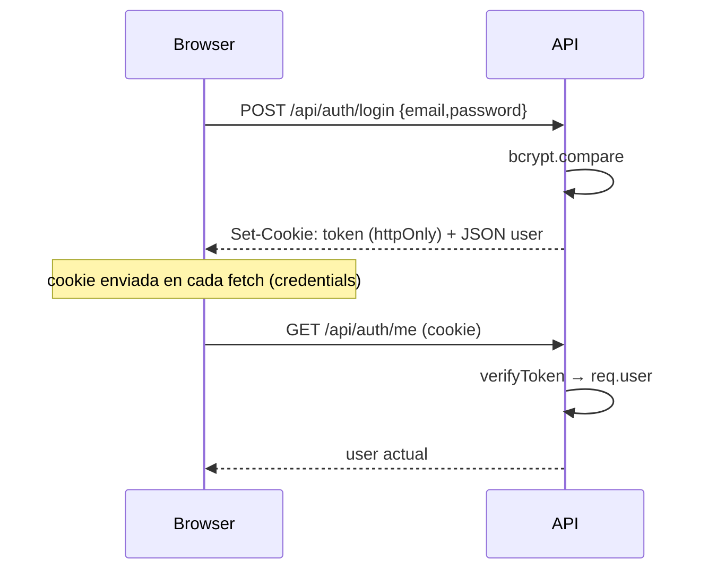

# Diagramas Mermaid

Centralizo aquí los diagramas para referencia rápida. Obsidian los renderiza nativamente.

## Arquitectura

## Modelo de datos (simplificado)

> [!info] Modelo completo
> Ver [[Modelo de datos]] para todas las tablas y campos (incluye `Supply`/`PointSupply`, `Validation`, `PointUpdate`, etc.).

## Ciclo de vida de un punto offer_help

## Ciclo de vida de un reporte need_help

Ver [[Estados y ciclos de vida de un Punto]].

## Flujo de creación de punto

Ver [[Flujo de creación de un Punto]].

## Flujo de autenticación

Ver [[Autenticación JWT + cookies]].

## Relacionado

- [[Arquitectura general]]
- [[Modelo de datos]]
- [[Estados y ciclos de vida de un Punto]]
