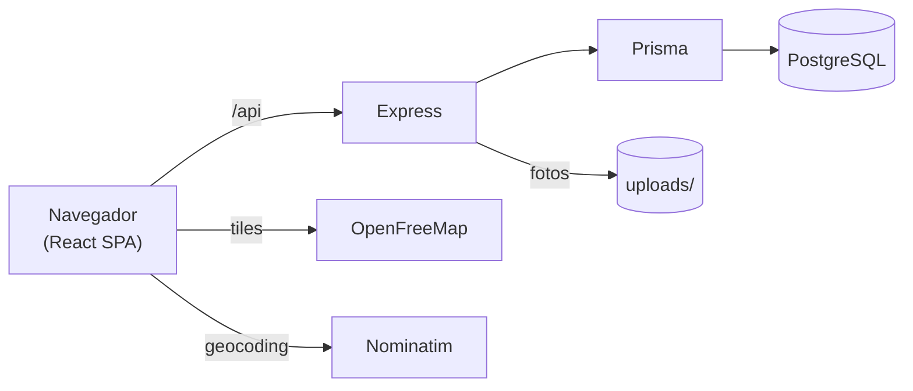
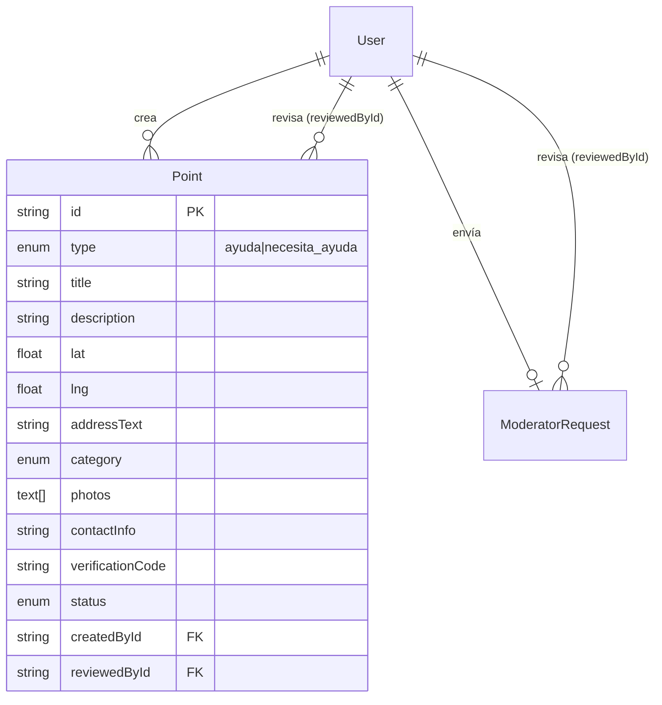
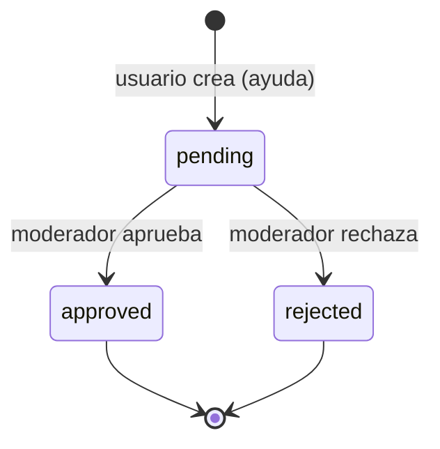
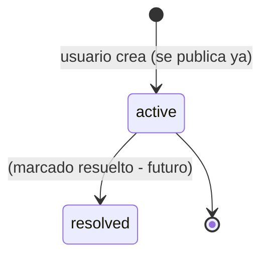
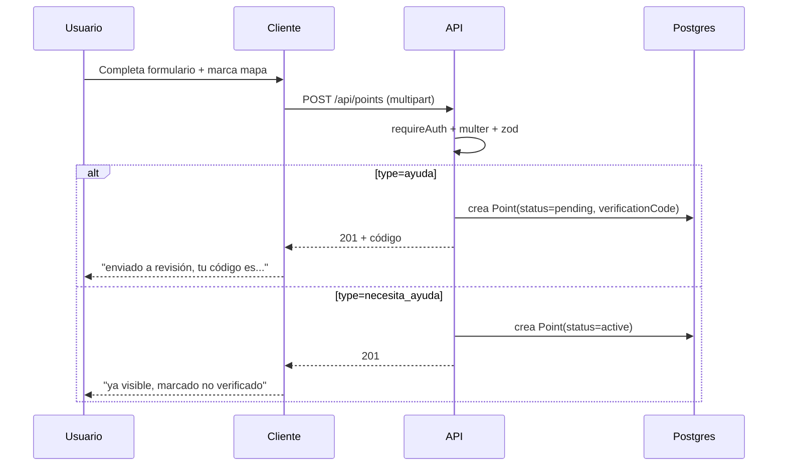
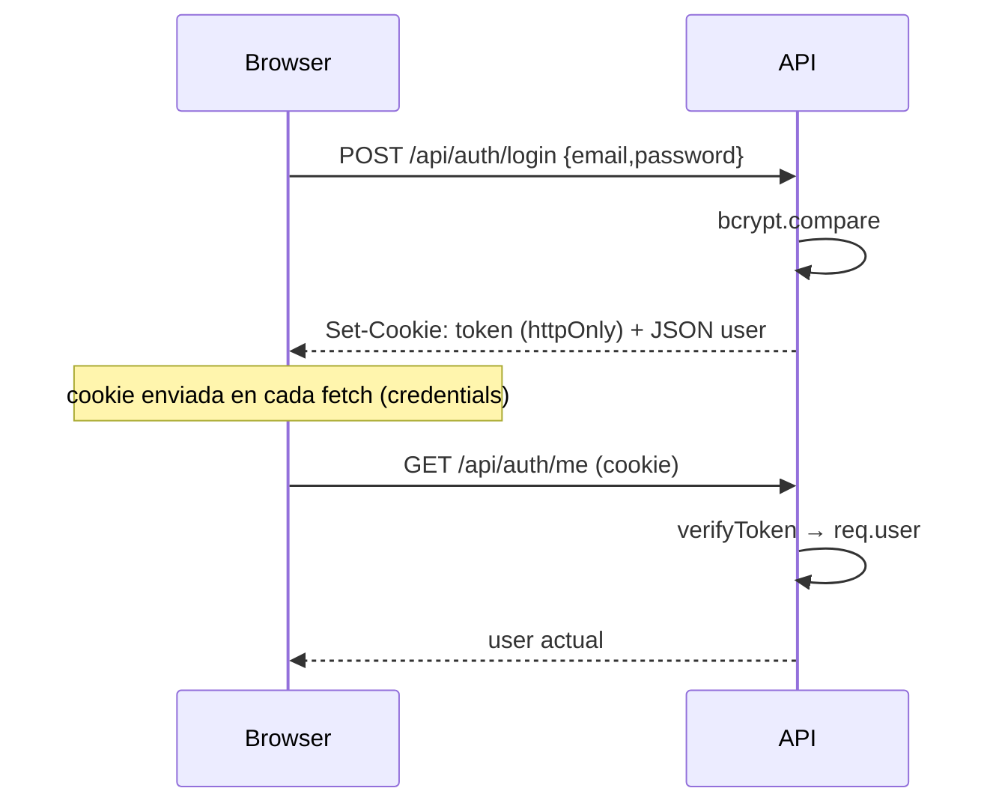

# Diagramas Mermaid

Centralizo aquí los diagramas para referencia rápida. Obsidian los renderiza nativamente.

## Arquitectura

## Modelo de datos (actual, simplificado)

## Ciclo de vida de un Punto de ayuda

## Ciclo de vida de un reporte necesita_ayuda

Ver [[Estados y ciclos de vida de un Punto]].

## Flujo de creación de punto

Ver [[Flujo de creación de un Punto]].

## Flujo de autenticación

Ver [[Autenticación JWT + cookies]].

## Relacionado

- [[Arquitectura general]]
- [[Modelo de datos (actual)]]
- [[Estados y ciclos de vida de un Punto]]
