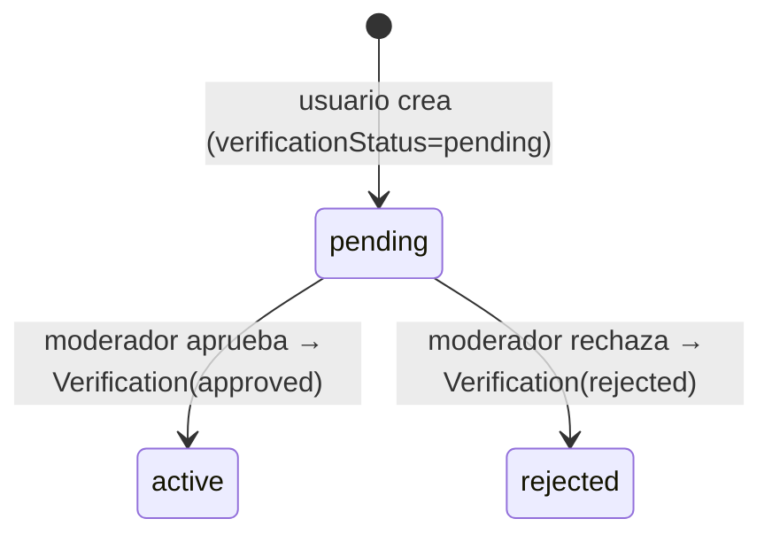
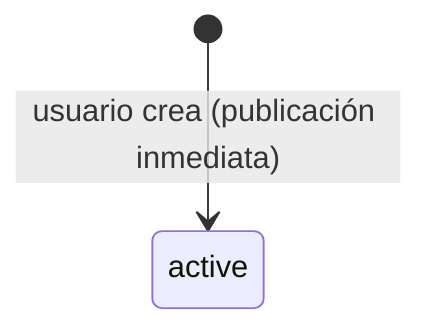
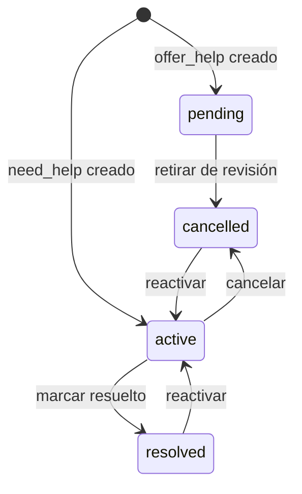

# Estados y ciclos de vida de un Punto

Modelo vigente (ver [[Modelo de datos]]). El `PointStatus` tiene 6 valores, pero su uso depende del `type`.

## Visión rápida

| Status | Significado | ¿visible públicamente? |
|---|---|---|
| `pending` | Esperando revisión de moderador | ❌ |
| `active` | Publicado | ✅ (`offer_help` tras aprobación; `need_help` desde el inicio) |
| `resolved` | Caso resuelto | ✅ (en `need_help`) |
| `rejected` | Rechazado por moderador | ❌ |
| `expired` | Expiró (`expiresAt`) | ❌ (declarado, sin endpoint que lo asigne aún) |
| `cancelled` | Cancelado | ❌ (declarado, sin endpoint aún) |

> [!info] La regla de visibilidad está en el código
> `points.routes.ts`:
> ```
> offer_help → visible solo si verificationStatus = approved
> need_help  → visible si status ∈ { active, resolved }
> ```

## Punto de oferta de ayuda (`type=offer_help`)



- Nace `pending` con `verificationStatus = pending`.
- La aprobación/rechazo la hace un moderador (ver [[Flujo de moderación]]): crea un registro en `Verification` y actualiza `verificationStatus` (+ `status` a `active` o `rejected`).

## Reporte de persona no ubicada (`type=need_help`)



- Nace `active` directamente (no hay moderación previa).
- En la UI se muestra con badge **"No verificado"** (ver [[Componentes del cliente]]).
- `resolved` existe pero **no hay endpoint** que lo asigne todavía → estado reservado para futuro.

## Estados reservados / sin uso

- `expired`: declarado en el enum, sin path manual (se asigna por `expiresAt` automáticamente). 
- `rejected`: estado terminal del flujo de **verificación** (moderador rechaza un `offer_help`). No entra en la máquina de estados del ciclo de vida.

## Máquina de estados (ciclo de vida gestionable)

El cambio de `status` lo gestiona el **creador** del punto o un **moderador** directamente; otros usuarios lo **solicitan** (ver más abajo). La verificación (`approve`/`reject`/`verify`) sigue siendo exclusiva del moderador y **no** forma parte de esta máquina.



| Transición | Quién la puede aplicar | Efecto en visibilidad |
|---|---|---|
| `active → resolved` | creador o moderador | Oculto del mapa **por defecto** (toggle "Mostrar resueltos"); badge **"Resuelto"** |
| `active → cancelled` | creador o moderador | Se **oculta** del mapa (sin toggle) |
| `pending → cancelled` | creador o moderador | Retira el `offer_help` de la cola de revisión |
| `resolved → active` | creador o moderador | Reactiva el punto |
| `cancelled → active` | creador o moderador | Reactiva el punto |

> [!info] Resueltos ocultos por defecto en el mapa
> Para no saturar el mapa con info innecesaria, los puntos `resolved` **no se muestran** salvo que el usuario active **"Mostrar resueltos"** en el panel de filtros. El backend los sigue devolviendo; el filtrado es en el cliente (`Home.filteredPoints`). Siguen accesibles por su link compartible (`/p/:code`) y en el tab "Estado".

> [!info] Puntos anónimos
> Un punto sin creador (`createdById=null`, p. ej. `need_help` anónimo) **solo** puede cambiar de estado un moderador.

## Solicitudes de cambio de estado

Un usuario que **no** es el creador ni moderador puede solicitar un cambio de estado (`resolved`/`cancelled`). La solicitud incluye un **motivo** opcional y queda **pendiente** hasta que un moderador la aprueba (entonces se aplica) o rechaza. Solo **una pendiente por (usuario, punto)**. El moderador ve estas solicitudes en una tercera cola del panel `/moderador`.

## Relacionado

- [[Modelo de datos]]
- [[Tipos de Punto - ayuda vs necesita_ayuda]]
- [[Flujo de creación de un Punto]]
- [[Flujo de moderación]]

