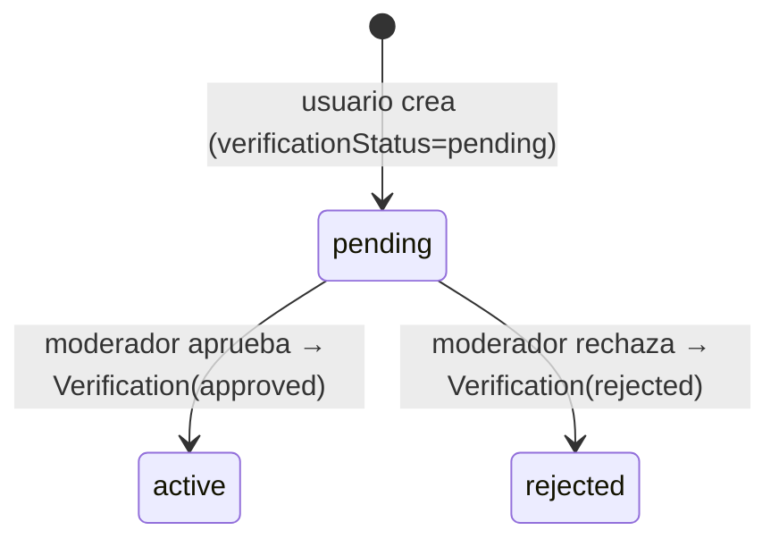
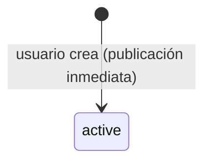

# Estados y ciclos de vida de un Punto

Modelo vigente (ver [[Modelo de datos]]). El `PointStatus` tiene 6 valores, pero su uso depende del `type`.

## Visión rápida

| Status | Significado | ¿visible públicamente? |
|---|---|---|
| `pending` | Esperando revisión de moderador | ❌ |
| `active` | Publicado | ✅ (`offer_help` tras aprobación; `need_help` desde el inicio) |
| `resolved` | Caso resuelto | ✅ (en `need_help`) |
| `rejected` | Rechazado por moderador | ❌ |
| `expired` | Expiró (`expiresAt`) | ❌ (declarado, sin endpoint que lo asigne aún) |
| `cancelled` | Cancelado | ❌ (declarado, sin endpoint aún) |

> [!info] La regla de visibilidad está en el código
> `points.routes.ts`:
> ```
> offer_help → visible solo si verificationStatus = approved
> need_help  → visible si status ∈ { active, resolved }
> ```

## Punto de oferta de ayuda (`type=offer_help`)



- Nace `pending` con `verificationStatus = pending`.
- La aprobación/rechazo la hace un moderador (ver [[Flujo de moderación]]): crea un registro en `Verification` y actualiza `verificationStatus` (+ `status` a `active` o `rejected`).

## Reporte de persona no ubicada (`type=need_help`)



- Nace `active` directamente (no hay moderación previa).
- En la UI se muestra con badge **"No verificado"** (ver [[Componentes del cliente]]).
- `resolved` existe pero **no hay endpoint** que lo asigne todavía → estado reservado para futuro.

## Estados reservados / sin uso

- `expired` y `cancelled`: declarados en el enum, sin path para llegar a ellos.
- `resolved`: declarado, sin endpoint (igual que antes).

## Relacionado

- [[Modelo de datos]]
- [[Tipos de Punto - ayuda vs necesita_ayuda]]
- [[Flujo de creación de un Punto]]
- [[Flujo de moderación]]

