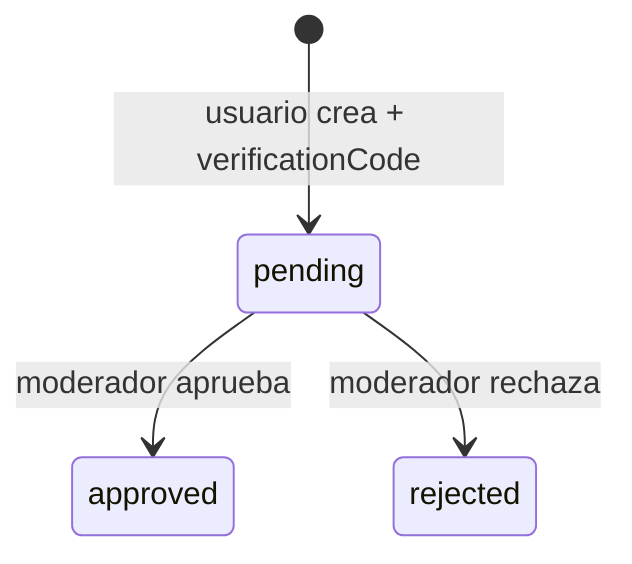
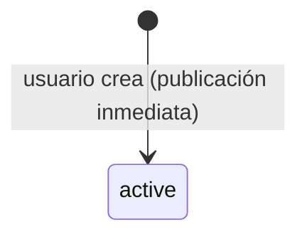

# Estados y ciclos de vida de un Punto

Modelo **actual** (ver [[Modelo de datos (actual)]]). El `PointStatus` tiene 5 valores, pero se usan distinto según el `type`.

## Visión rápida

| Status | Significado | ¿visible públicamente? |
|---|---|---|
| `pending` | Esperando revisión de moderador | ❌ |
| `approved` | Verificado y publicado | ✅ (solo tipo `ayuda`) |
| `active` | Publicado directo, sin verificar | ✅ (solo tipo `necesita_ayuda`) |
| `resolved` | Caso resuelto | ✅ (en `necesita_ayuda`) |
| `rejected` | Rechazado por moderador | ❌ |

> [!info] La regla de visibilidad está en el código
> `PUBLIC_STATUSES` en `points.routes.ts`:
> ```
> ayuda         → [approved]
> necesita_ayuda → [active, resolved]
> ```

## Punto de ayuda (`type=ayuda`)



- Nace `pending` con un `verificationCode` (ver [[Sistema de verificación y código]]).
- Solo pasa a `approved` o `rejected` por acción de un moderador.
- No hay transición a `active` ni `resolved`.

## Reporte de persona no ubicada (`type=necesita_ayuda`)



- Nace `active` directamente (no hay moderación previa).
- `resolved` existe en el enum pero **no hay endpoint** que lo asigne todavía → es estado reservado para futuro.
- En la UI se muestra con badge **"No verificado"** (ver [[Componentes del cliente]]).

## Resumen de transiciones implementadas

| Desde | Hasta | Quién | Dónde |
|---|---|---|---|
| (creación) `ayuda` | `pending` | usuario | `POST /api/points` |
| (creación) `necesita_ayuda` | `active` | usuario | `POST /api/points` |
| `pending` | `approved` | moderador | `POST /api/moderator/points/:id/approve` |
| `pending` | `rejected` | moderador | `POST /api/moderator/points/:id/reject` |

## Estados no usados / huérfanos

- `resolved`: declarado, sin path para llegar a él.
- En el rediseño: se suman `expired` y `cancelled` (ver [[Modelo de datos (rediseño pendiente)]]).

## Relacionado

- [[Flujo de creación de un Punto]]
- [[Flujo de moderación]]
- [[Tipos de Punto - ayuda vs necesita_ayuda]]
