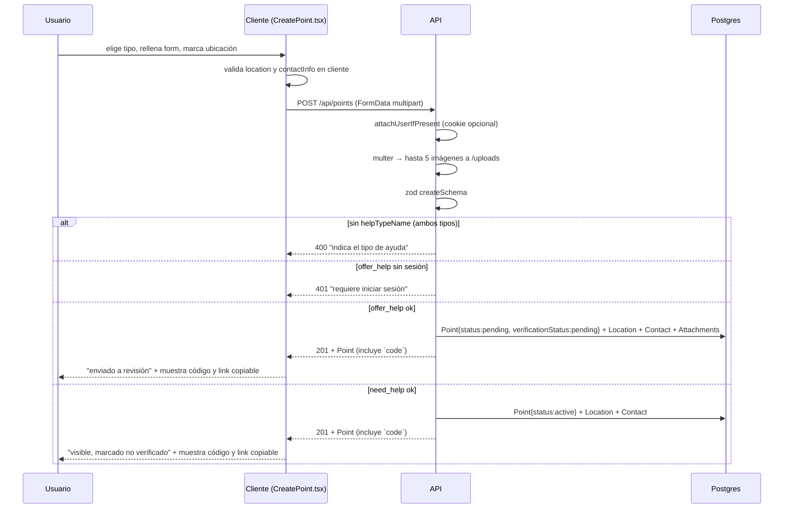

# Flujo de creación de un Punto

Cómo se crea un `Point` desde la UI hasta la DB. Ver [[Tipos de Punto - ayuda vs necesita_ayuda]] y [[Estados y ciclos de vida de un Punto]].

## Precondiciones

- **`offer_help`**: usuario autenticado (cookie `token` válida). Sin sesión, la UI bloquea la publicación y ofrece ir a `/login`.
- **`need_help`**: puede crearse **sin sesión** (anónimo). Si hay sesión, se asocia el autor (`createdById`).
- Coordenadas marcadas (por click en mapa o por búsqueda Nominatim).

## Pasos

## Validaciones (backend, `points.routes.ts`)

`createSchema` (zod):
- `type`: `need_help` | `offer_help`
- `title`: 3–150, `description`: 10–2000
- `lat`: -90…90, `lng`: -180…180 (`z.coerce.number()` desde string del FormData)
- `addressText?`, `city?`, `neighborhood?`
- `helpTypeName?`: obligatorio para **ambos** tipos (offer_help y need_help)
- `contactInfo?`: 3–200 (legacy, texto plano)
- `contacts?`: JSON `[{type,value}]` con `type` ∈ {phone,whatsapp,instagram,email,other} (preferido sobre `contactInfo`). Al menos un contacto válido es obligatorio.
- `locations?`: JSON `[{type,lat,lng,addressText?,city?,neighborhood?}]` con `type` ∈ {location,origin,destination} (preferido sobre los campos sueltos). Al menos una ubicación con coordenadas válidas es obligatoria.
- `expiresAt?`: fecha

Reglas extra:
- `helpTypeName` es obligatorio para **ambos** tipos (400 si falta). La sesión solo es obligatoria para `offer_help` (401 si no la hay); `need_help` puede ser anónimo (`createdById = null`). Se resuelve/crea por `upsert` un `HelpType`.
- `need_help` no exige sesión: `createdById` queda `null` (punto anónimo).
- Las ubicaciones (`locations`, o `lat`/`lng` sueltos como fallback) se guardan como filas de `Location` + `PointLocation` con su `locationType` (location/origin/destination). El formulario permite varias (p. ej. origen → destino). `city`/`neighborhood` se autocompletan desde la búsqueda (Nominatim) y son editables.
- Los contactos (`contacts`, o `contactInfo` como fallback) se guardan como filas de `Contact` con su `type` (phone/whatsapp/instagram/email/other) e `isPublic=true`.
- Las fotos van a `Attachment` (`type=image`), con URLs `/uploads/<uuid>.<ext>`.

## Detalle del FormData

El cliente arma `FormData` porque hay archivos. Por eso las validaciones numéricas usan `z.coerce.number()`. Ver [[Cliente HTTP (api)]] y [[Subida de fotos]].

## Pantalla de éxito

Depende del tipo, pero **ambas** muestran ahora el **código de verificación** (`Point.code`, 8 caracteres alfanuméricos sin prefijo) y un **link copiable** `/p/:code` para compartir:

- **`offer_help`**: banner verde "enviado a revisión" + código + link.
- **`need_help`**: banner verde "ya está visible, marcado como no verificado" + código + link.

El código permite a otros usuarios abrir el punto y **verificarlo** (confirmación comunitaria). Los puntos con más verificaciones aparecen primero en el listado del mapa (ver [[Verificación de puntos]]).

## Relacionado

- [[Modelo de datos]]
- [[Verificación de puntos]]
- [[Subida de fotos]]
- [[Mapa interactivo]]
- [[Búsqueda de direcciones]]
