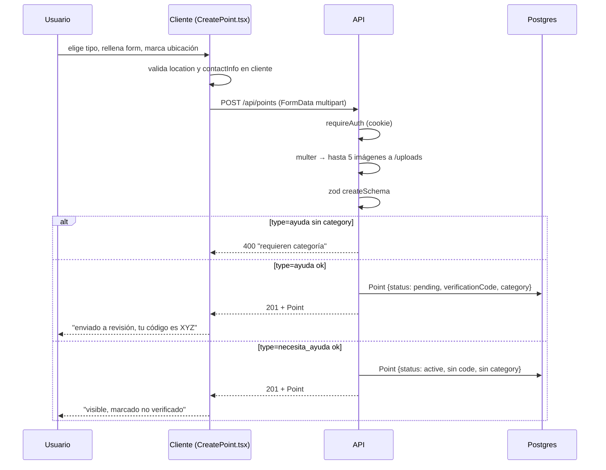

# Flujo de creación de un Punto

Cómo se crea un `Point` desde la UI hasta la DB. Ver [[Tipos de Punto - ayuda vs necesita_ayuda]] y [[Estados y ciclos de vida de un Punto]].

## Precondiciones

- Usuario autenticado (cookie `token` válida). Si no, la UI redirige a `/login`.
- Coordenadas marcadas (por click en mapa o por búsqueda Nominatim).

## Pasos

## Validaciones (backend, `points.routes.ts`)

`createSchema` (zod):
- `type`: `ayuda` | `necesita_ayuda`
- `title`: 3–150
- `description`: 10–2000
- `lat`: -90…90, `lng`: -180…180 (coerce desde string del FormData)
- `addressText?`: hasta 300
- `category?`: enum de 5 valores
- `contactInfo`: 3–200 (obligatorio)

Reglas extra:
- Si `type=ayuda` → `category` obligatoria (404 si no).
- Fotos: array de URLs `/uploads/<uuid>.<ext>`.

## Detalle del FormData

El cliente arma `FormData` porque hay archivos. Por eso las validaciones numéricas usan `z.coerce.number()`. Ver [[Cliente HTTP (api)]] y [[Subida de fotos]].

## Pantalla de éxito

Depende del tipo:
- **`ayuda`**: banner verde con el `verificationCode` en mono, explicando que un moderador lo contactará por Instagram/canal oficial **citando ese código** para validar identidad.
- **`necesita_ayuda`**: banner verde "ya está visible, marcado como no verificado".

## Relacionado

- [[Sistema de verificación y código]]
- [[Subida de fotos]]
- [[Mapa interactivo]]
- [[Búsqueda de direcciones]]
