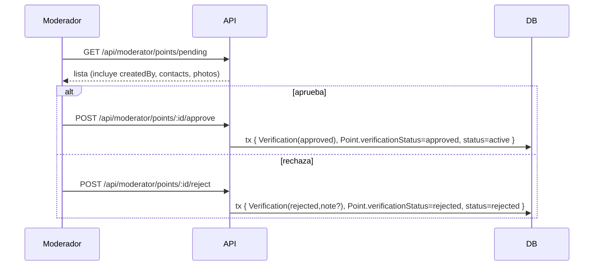
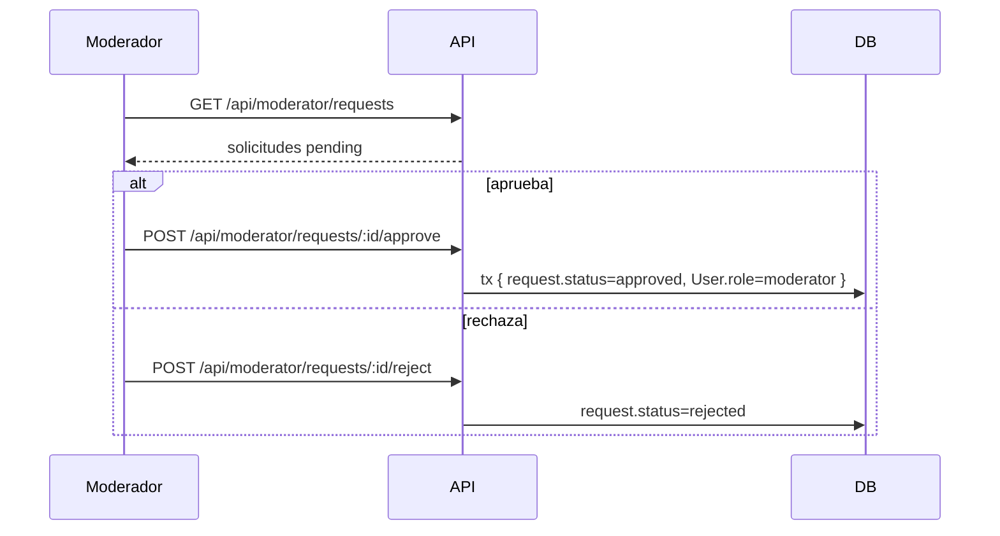

# Flujo de moderación

Dos colas de trabajo para el moderador: **puntos** y **solicitudes**. La UI está en la página `/moderador` (componente `ModeratorDashboard`).

## Cola 1: Puntos de oferta pendientes

Solo se revisan puntos `type=offer_help AND verificationStatus=pending` (los `need_help` **no** se moderan previamente).

- Endpoints: `GET /points/pending`, `POST /points/:id/approve`, `POST /points/:id/reject`.
- Cada acción **crea un registro en `Verification`** (quién moderó, estado, nota) y actualiza `verificationStatus` + `status`. Así queda historial.
- Si el punto no es `offer_help` o no está pendiente → 404.

## Cola 2: Solicitudes de moderador

Usuarios que pidieron ser moderadores (`wantsModerator` al registrarse).

- La aprobación es **atómica** (`prisma.$transaction`) — actualiza la solicitud y el rol del usuario a la vez.
- Una vez aprobado, ese usuario ve el link "Moderación" en su navbar.

## Punto importante

- Un moderador **puede moderar sus propios puntos o su propia solicitud**: no hay restricción de auto-revisión en el código. Ver [[Seguridad y consideraciones]].

## Relacionado

- [[Roles y permisos]]
- [[Verificación de puntos]]
- [[API REST - endpoints]]
- [[Estados y ciclos de vida de un Punto]]
