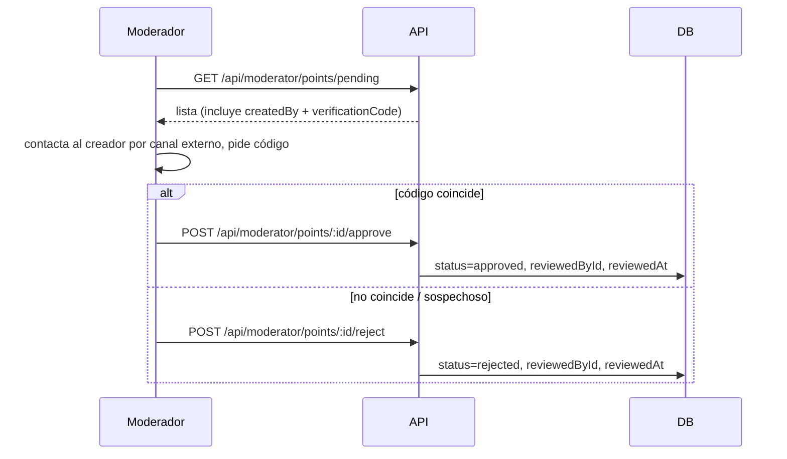
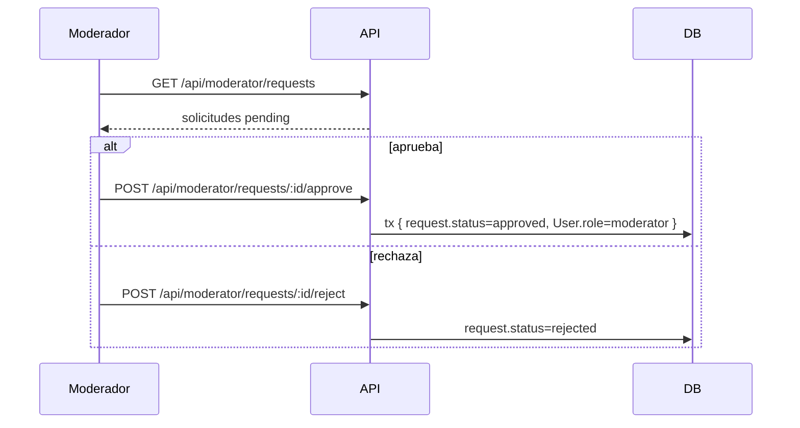

# Flujo de moderación

Dos colas de trabajo para el moderador: **puntos** y **solicitudes**. Ver [[ModeratorDashboard]] para la UI.

## Cola 1: Puntos de ayuda pendientes

Solo revisan puntos `type=ayuda AND status=pending` (los `necesita_ayuda` **no** se moderan previamente).

- Endpoints: `GET /points/pending`, `POST /points/:id/approve`, `POST /points/:id/reject`.
- Guardan quién revisó (`reviewedById`) y cuándo (`reviewedAt`).
- Si el punto no es `ayuda` o no está `pending` → 404.

## Cola 2: Solicitudes de moderador

Usuarios que pidieron ser moderadores (`wantsModerator` al registrarse).

- La aprobación es **atómica** (`prisma.$transaction`) — actualiza la solicitud y el rol del usuario a la vez.
- Una vez aprobado, ese usuario ve el link "Moderación" en su navbar.

## Punto importante

- Un moderador **puede moderar sus propios puntos o su propia solicitud**: no hay restricción de auto-revisión en el código. Ver [[Seguridad y consideraciones]].

## Relacionado

- [[Roles y permisos]]
- [[Sistema de verificación y código]]
- [[API REST - endpoints]]
- [[Estados y ciclos de vida de un Punto]]
